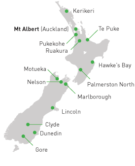
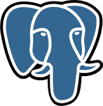
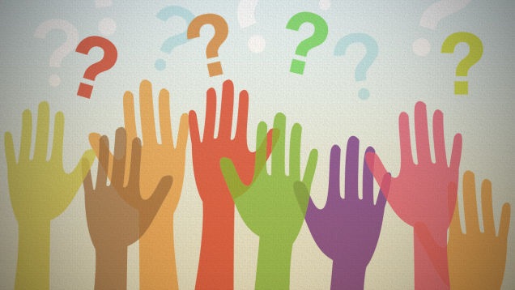

Kaka: Towards a Distrubuted Genotype Information System
========================================================
author: Helge Dzierzon and Samantha Baldwin
date: October 28 2015

TOC
========================================================

* Why
* How?
* Status
* Conclusions

Genotype Data in PFR
========================================================

* Many species
  + e.g. Kiwifruit, Apple, Pear, Potato, Grape, ...
* Genotype data we are concentrating on 
  + GBS
  + QTL
* Others?
  + Expression data?

Issues by PFR distribution of Wetware
========================================================

* 15 PFR sites
* Communication across sites difficult
* Access to the data via shared drives
* Data currently stored in Excel sheets

***

Existing Databases Initiatives in PFR
========================================================

* EBrida (provenance)
* Kea (sample tracking)
* Ensembl (Genome Browsing)

DBs in development @PFR
========================================================

* Kaka (Genotypes concentrates on samples)
* Kakapo (Location)

Kaka
========================================================

* Supplmenet to Kea
* Python Django
* PGSQL and JSON (NoSQL)
* Docker Farms
* Continuous integration
* Needs location  (Chr, location on Chromosome)

***

Status
========================================================

* DB has been developed as a proof of concept
* Some example data have been loaded
* RStudio, noteboods databases etc. have been attached and can access api
* API has been developed

***

Screenshot

Conclusions
========================================================

* Genotype and phenotype data in one database
* Kea needs a schnittstelle 
* It is a great tool already but needs a nerd
* It needs some input from teh research community
* The data input is very manual
* Better visualisation

Thank you! Questions?
========================================================

